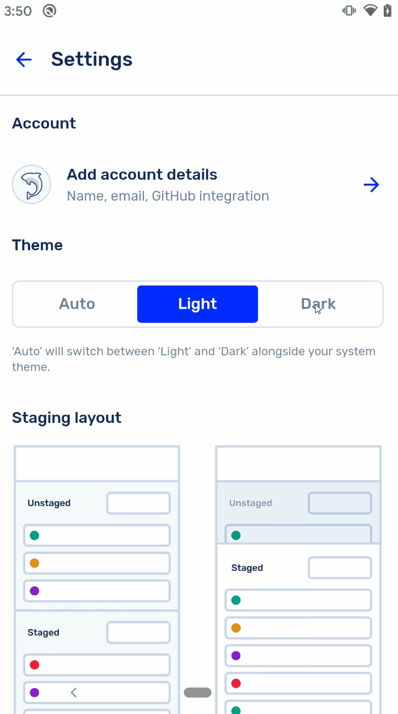
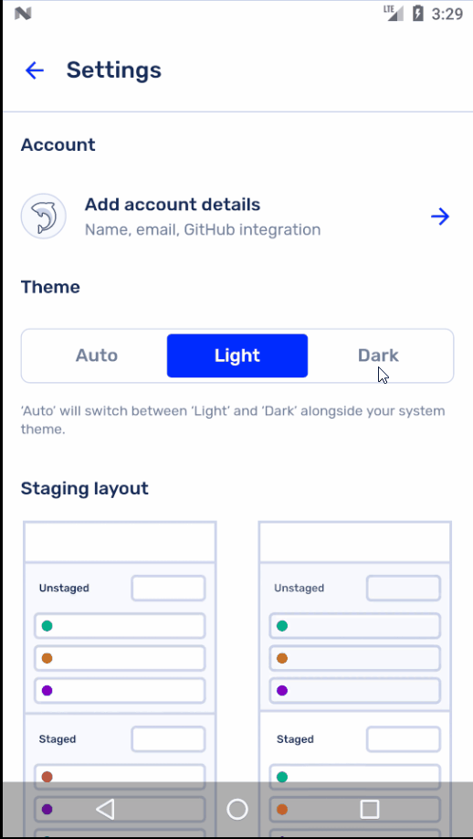

<h1 align="center">
  React Native Immersive Bars
</h1>

<div align="center">

[](https://www.npmjs.com/package/react-native-immersive-bars/)

</div>

<div align="center">





</div>

> Do you like the button slider that changes from light to dark mode? [That's another package that I've built: `react-native-button-toggle-group`](https://github.com/crutchcorn/react-native-button-toggle-group)

[Google officially suggests apps that target Q or higher to render content under the statusbar and navbar](http://youtube.com/watch?v=Nf-fP2u9vjI).
However, [doing so previously was difficult to do and required some customization and tweaking](https://unicorn-utterances.com/posts/draw-under-navbar-using-react-native/). Not to mention the variant support for other APIs.

Well, this package enables you to easily do so across various Android APIs levels. It also mocks out usage with iOS and other platforms, so you're able to use it in cross-platform apps.

> ⚠ This package only supports Android 5.0 and higher ⚠
>
> This package is meant to be used alongside [the `react-native-safe-area-context` package](https://github.com/th3rdwave/react-native-safe-area-context) in order
> to provide proper padding and margins in order to keep scrollviews and others from being stuck forever under the navbar.
>
> Please refer to that package's README for more information on how to use it.

## Install

```
npm i --save react-native-immersive-bars
```

Or

```
yarn add react-native-immersive-bars
```

### Android

If you're targeting API 29+ in your React Native app, you need to do one more step to enable the fully transparent bars. Add:

```xml
<item name="android:enforceNavigationBarContrast">false</item>
```

To:

```
android\app\src\main\res\values\styles.xml
```

## Usage

### Usage in JavaScript

```jsx
import {changeBarColors} from 'react-native-immersive-bars';

// ...

React.useEffect(() => {
    changeBarColors(isDarkMode, '#50000000', 'transparent');
    // or changeBarColors(isDarkMode);
}, [isDarkMode]);
```

The `changeBarColors` function has a single required parameter and two optional ones. 

- `isDarkMode` (Required): If the app is in dark mode or not - will apply proper styling to icons and statusbar/navbar background
- `translucentLightStr` (Optional): When a translucent bar must be drawn (due to API restrictions), what color it should be drawn in light mode
- `translucentDarkStr` (Optional): When a translucent bar must be drawn (due to API restrictions), what color it should be drawn in dark mode

Both `translucentLightStr` and `translucentDarkStr` accept and color that [Color.parseColor](https://developer.android.com/reference/android/graphics/Color#parseColor(java.lang.String)) is able to handle as well as the string `'transparent'`.

> THIS MEANS THAT THREE DIGIT HEX SHORTHAND LIKE `#FFF` WILL CAUSE YOUR APP TO CRASH

### Adding to `onCreate` (Optional)

If you only use the JavaScript code, your app will flash the navbar once the App.tsx code finally renders. 
If you want to avoid a jump like that, you can edit your code in:
 
```
android > app > src > main > java > yourpackagepath > MainActivity.java
```

And change the code to reflect this:

```java
import com.facebook.react.ReactActivity;
import com.rnimmersivebars.ImmersiveBars; // here

public class MainActivity extends ReactActivity {
   @Override
    protected void onCreate(Bundle savedInstanceState) {
        boolean isDarkMode = false; // Customize this to match your app's default theme
        ImmersiveBars.changeBarColors(this, isDarkMode);  // here
        super.onCreate(savedInstanceState);
    }
    // ...other code
}
```

## Alternatives

If you don't need to use a fullscreen navbar, then you can simply change the color of the navbar itself with this package:

- [`react-native-navigation-bar-color`](https://github.com/thebylito/react-native-navigation-bar-color)

Note that this package does not play nice with [`react-native-safe-area-context`'s edge detection](https://github.com/th3rdwave/react-native-safe-area-context/).


Otherwise, if you want to hide the navbar and the statusbar in their entirety, I'd suggest taking a look at the following package:

- [`react-native-immersive`](https://github.com/mockingbot/react-native-immersive)
